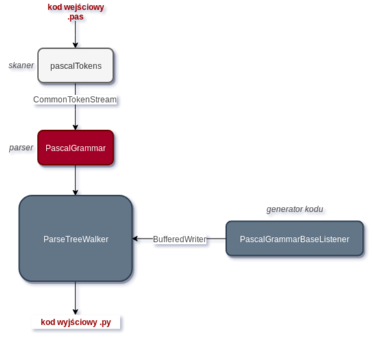

# 🐍 PasPy 🐍
a simple pascal to python transpiler 

## Description 

Main purpose of PasPy transpiler is to take a .pas file from user and translate it into python output code .py. 
It doesn't support all Pascal syntax! Not allowed: files, for, while, arrays, pointers. 

Due to Pascal's and Python's different structures, it converts only simple code: vars, procedures, functions, arithmetics, prints and if-else statements. 


Simple pascal grammar can be found [here.](https://github.com/hechsewa/kompilatory/blob/master/transpiler/antlr/paspy/src/main/antrl4/PascalGrammar.g4)

Simple pascal tokens can be found [here.](https://github.com/hechsewa/kompilatory/blob/master/transpiler/antlr/paspy/src/main/antrl4/pascalTokens.g4)

## UML diagram 



## Dependencies and how to run 

Lexer and Parser were generated with Antlr4, so you need a .jar file of at least 4.7.1 version.
You need: 
  * antlr4 jar & dependencies
  * jdk min 8.0 

### How to run 
Git clone the repo. 

``` git clone https://github.com/hechsewa/kompilatory ```

#### Terminal way

``` cd antlr/paspy/src/main/antrl4 ```

compile all java files in the directory and then:

``` java PaspyTranspiler [path to .pas file]```

open program.py created in the project directory

### IntelliJ way
Open IntelliJ Ultimate, export project directory (paspy). 

Build project module. Set the source .pas file in the configuration settings. Right click on the PaspyTranspiler.java -> Run.

## Examples 

Example translations can be found [here.](https://github.com/hechsewa/kompilatory/tree/master/transpiler/antlr/paspy/src/main/examples) 

Created by Ewa Hechsman & Laura Żuchowska as an assignment for Theory of compiling and Compilers course (AGH University of Science and Technology), 2019. 
